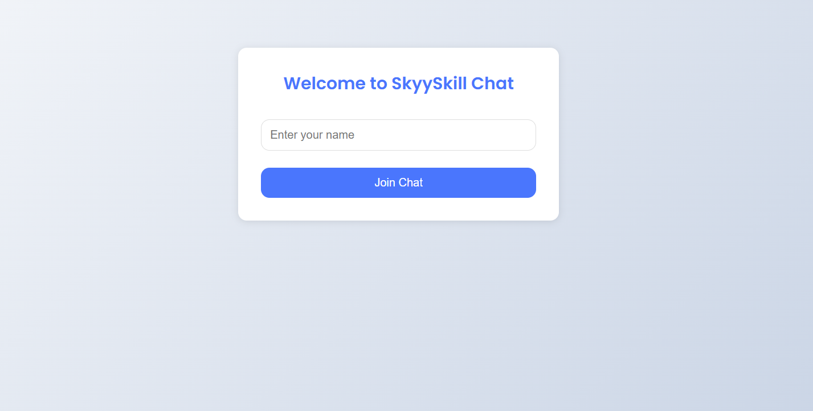
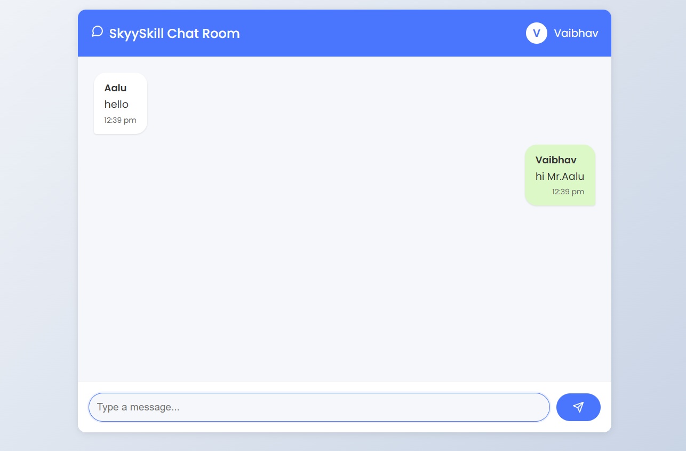

# Realtime Chat App with React & Socket.io

This is a real-time chat application built as part of a certified workshop by **Skyy Skill Academy** on _May 5th, 2025_. The app allows users to join a chat room with a username and exchange messages in real time.

---

## 🚀 Features

- Real-time messaging using Socket.io
- React-based frontend with a responsive UI
- Express.js server handling WebSocket connections
- Avatar initials and timestamps for every message
- Broadcast messaging across all connected clients
- Auto-scroll to the latest message
- Styled with modern CSS and animations

---

## 🛠️ Technologies Used

- **Frontend**: React, CSS
- **Backend**: Node.js, Express.js, Socket.io

---

## 📸 Screenshots

  

---

## 🧑‍💻 Getting Started

### 📦 Backend (Express + Socket.io)

cd beckend
npm install
node index.js

### 💻 Frontend (React)

cd frontend
npm install
npm start

### Note: Ensure the backend is running on http://localhost:3001 — the frontend expects it there.

## 📜 Certificate

This project was completed as part of the "Building a Realtime Chat App with React and Socket.io" certified workshop by Skyy Skill Academy.

